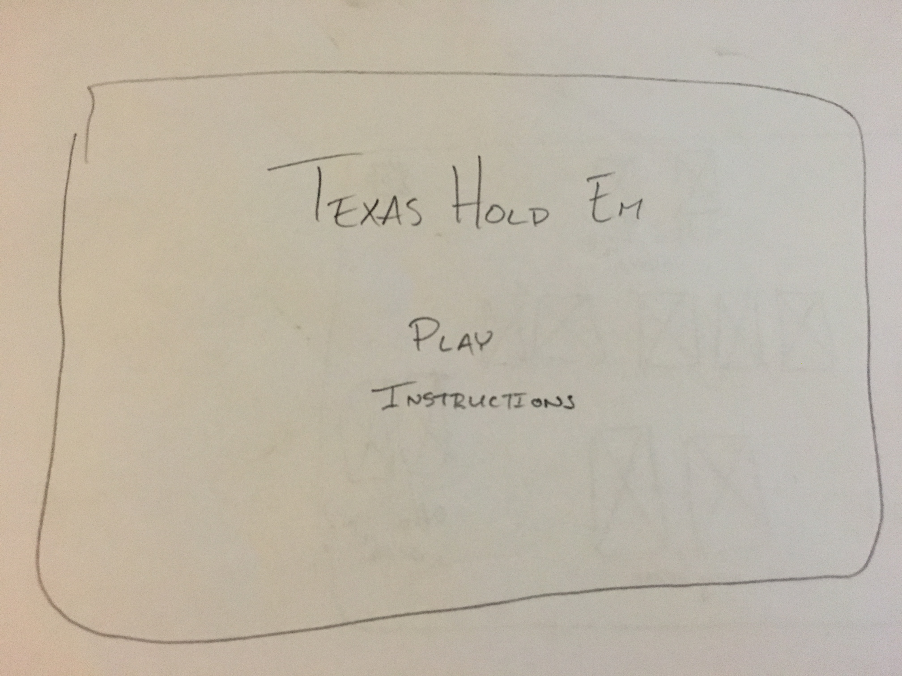

# Project 1 - Texas Hold Em

This is my first project for WDI\_SM_43

##**Technologies Used**
HTML  
CSS  
Javascript  

##**Approach Taken**
Attempted to logically separate each combination of cards

##**Installation Instructions**
Clone the repo  
Open index.html in your browser

##**Unsolved Problems**
Few fringe card combinations do not register correctly

#####[Trello Board](https://trello.com/b/nWphyNx2/project-1-texas-hold-em)

